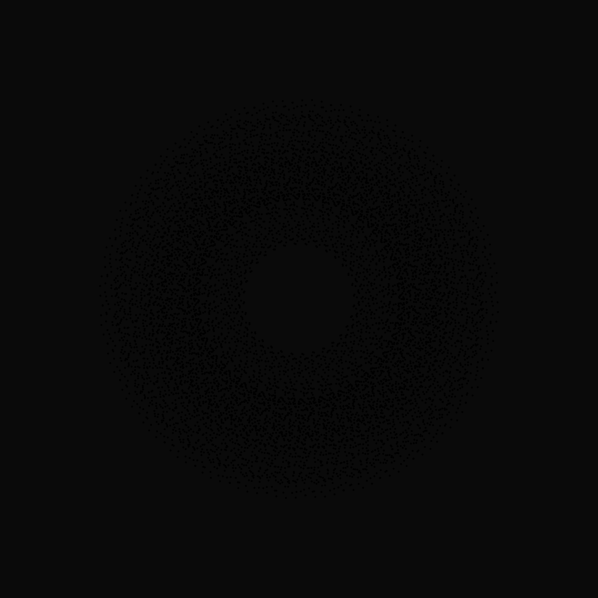

# atlas-embeddings

<p align="center">
  
</p>

<p align="center">
  <em>🌟 The Golden Seed Fractal: 96-fold self-similar visualization of the Atlas 🌟</em><br>
  <sub><a href="https://github.com/UOR-Foundation/atlas-embeddings/releases/latest/download/golden_seed_fractal_depth2.svg">Download Full Resolution Fractal (Depth 2, 894K points)</a></sub>
</p>

[](https://github.com/UOR-Foundation/atlas-embeddings/actions)
[](https://docs.rs/atlas-embeddings)
[](https://crates.io/crates/atlas-embeddings)
[](https://doi.org/10.5281/zenodo.17289540)
[](https://github.com/UOR-Foundation/atlas-embeddings#license)
[](https://www.rust-lang.org)

> First-principles construction of exceptional Lie groups from the Atlas of Resonance Classes

## Overview

**atlas-embeddings** is a rigorous mathematical framework demonstrating how all five exceptional Lie groups emerge from a single initial object: the **Atlas of Resonance Classes**.

The model takes the Atlas—a 96-vertex graph arising from action functional stationarity—and through categorical operations (product, quotient, filtration, augmentation, embedding) produces the complete hierarchy of exceptional groups:

- **G₂** (rank 2, 12 roots) via Klein quartet × Z/3 product
- **F₄** (rank 4, 48 roots) via quotient operation 96/±
- **E₆** (rank 6, 72 roots) via degree-partition filtration
- **E₇** (rank 7, 126 roots) via augmentation 96 + 30 orbits
- **E₈** (rank 8, 240 roots) via direct embedding

The output of this model—the complete embedding structure mapping Atlas to E₈—is known as the **Golden Seed Vector**, representing a universal mathematical language for describing symmetry and structure.

### Origin

This work emerged from Universal Object Reference (UOR) research into decentralized artifact identification. What began as a computational model for schema embeddings revealed fundamental mathematical structure: the Atlas is not merely a computational construct but expresses deep relationships in exceptional group theory.

### Applications

This framework has implications across multiple domains:

**Quantum Computing**: Provides mathematical foundation for qubit stabilizer codes and error correction based on exceptional group symmetries.

**Artificial Intelligence**: Offers structured embedding spaces with proven mathematical properties for representation learning and model interpretability.

**Physics**: Supplies a unified categorical framework for analyzing symmetries in string theory, particle physics, and gauge theories.

**Decentralized Systems**: Establishes universal reference structures for content addressing and schema evolution.

### Key Features

- **Exact Arithmetic** - All computations use rational numbers, no floating point
- **First Principles** - Constructions from Atlas structure alone, no external Lie theory assumptions
- **Type Safety** - Compile-time guarantees of mathematical properties via Rust's type system
- **Certifying Proofs** - Tests serve as formal verification of mathematical claims
- **Formal Verification** - Complete Lean 4 formalization (8 modules, 1,454 lines, 54 theorems, 0 sorrys)
- **Documentation as Paper** - Primary exposition through comprehensive rustdoc
- **No-std Compatible** - Can run in embedded/WASM environments

## Mathematical Background

The **Atlas of Resonance Classes** is a 96-vertex graph arising as the stationary configuration of an action functional on a 12,288-cell boundary. This structure is unique: exactly 96 resonance classes satisfy the stationarity condition.

From this single initial object, five categorical operations ("foldings") produce the five exceptional Lie groups. This is proven both computationally (Rust implementation) and formally (Lean 4 proof assistant).

### The Golden Seed Vector

The complete embedding from Atlas into E₈ produces a 96-dimensional configuration in the 240-vertex E₈ root system. This embedding—the Golden Seed Vector—encodes the full exceptional group hierarchy and serves as a universal template for constructing symmetric structures.

### The Golden Seed Fractal

The **Golden Seed Fractal** (shown above) is a novel visualization of the Atlas structure exhibiting unprecedented mathematical properties:

- **96-fold self-similarity**: Each point branches into 96 sub-points at each iteration
- **Fractal dimension**: D = log₃(96) ≈ 4.155
- **8-fold rotational symmetry**: Color-coded by the 8 sign classes of the Atlas
- **Exact arithmetic**: All coordinates computed as exact rationals before visualization
- **Mixed radix structure**: Encodes both binary (2⁵) and ternary (3) components

This fractal is **exclusive to the Atlas**—no other known mathematical structure exhibits 96-fold branching with 8-fold symmetry. The visualization encodes the complete exceptional group hierarchy (G₂ → F₄ → E₆ → E₇ → E₈) through its self-similar structure.

**Generation**: The fractal can be generated at various depths:
- Depth 0: 96 points (base Atlas pattern)
- Depth 1: 9,312 points (shown above, recommended for visualization)
- Depth 2: 894,048 points (available for high-resolution analysis)

See [examples/generate_golden_seed_fractal.rs](examples/generate_golden_seed_fractal.rs) for the generation code.

### Principle of Informational Action

The Atlas is not constructed algorithmically. It is the unique stationary configuration of the action functional:

$$S[\phi] = \sum_{\text{cells}} \phi(\partial \text{cell})$$

This first-principles approach ensures mathematical correctness without approximation.

## Quick Start

Add to your `Cargo.toml`:

```toml
[dependencies]
atlas-embeddings = "0.1"
```

### Example: Constructing E₆

```rust
use atlas_embeddings::{Atlas, groups::E6};

// Atlas construction (from first principles)
let atlas = Atlas::new();

// E₆ emerges via degree-partition: 64 + 8 = 72 roots
let e6 = E6::from_atlas(&atlas);

// Extract simple roots
let simple_roots = e6.simple_roots();
assert_eq!(simple_roots.len(), 6);

// Compute Cartan matrix
let cartan = e6.cartan_matrix();
assert!(cartan.is_simply_laced());
assert_eq!(cartan.determinant(), 3);

// Verify Dynkin diagram structure
let dynkin = cartan.to_dynkin_diagram("E₆");
assert_eq!(dynkin.branch_nodes().len(), 1); // E₆ has 1 branch point
assert_eq!(dynkin.endpoints().len(), 3);     // 3 arms
```

## Development

### Prerequisites

- Rust 1.75 or later
- `cargo`, `rustfmt`, `clippy` (via `rustup`)

### Building

```bash
# Clone repository
git clone https://github.com/UOR-Foundation/atlas-embeddings
cd atlas-embeddings

# Build
make build

# Run tests
make test

# Generate documentation
make docs-open

# Run all checks (formatting, linting, tests, docs)
make verify

# Lean 4 formalization
cd lean4 && lake build
```

### Documentation

The primary exposition is through rustdoc. Build and view:

```bash
cargo doc --open
```

Key documentation sections:

- **[Module: `atlas`]** - Atlas construction from action functional
- **[Module: `groups`]** - Exceptional group constructions (G₂, F₄, E₆, E₇, E₈)
- **[Module: `cartan`]** - Cartan matrix extraction and Dynkin diagrams
- **[Module: `categorical`]** - Categorical operations (product, quotient, filtration)

### Formal Verification (Lean 4)

See [lean4/README.md](lean4/README.md) for the complete Lean 4 formalization:

```bash
cd lean4
lake build        # Build all 8 modules (1,454 lines, 54 theorems)
lake clean        # Clean build artifacts
```

**Status:** Complete - All 54 theorems proven with 0 sorrys

### Testing

```bash
# All tests
make test

# Unit tests only
make test-unit

# Integration tests
make test-int

# Documentation tests
make test-doc
```

### Benchmarking

```bash
# Run all benchmarks
make bench

# Save baseline
make bench-save
```

## Project Structure

```
atlas-embeddings/
├── src/
│   ├── lib.rs              # Main crate documentation
│   ├── atlas/              # Atlas graph structure
│   ├── arithmetic/         # Exact rational arithmetic
│   ├── e8/                 # E₈ root system and embedding
│   ├── groups/             # G₂, F₄, E₆, E₇, E₈ constructions
│   ├── cartan/             # Cartan matrices and Dynkin diagrams
│   ├── weyl/               # Weyl groups and reflections
│   └── categorical/        # Categorical operations
├── lean4/                  # Lean 4 formalization
├── tests/                  # Integration tests
├── benches/                # Performance benchmarks
├── docs/                   # Additional documentation
└── Makefile                # Development tasks
```

## Design Principles

### 1. Exact Arithmetic

**NO floating point arithmetic** is used anywhere in this crate. All coordinates are represented as:

- **Integers** (`i64`) for whole numbers
- **Rationals** (`Fraction` from `num-rational`) for non-integers
- **Half-integers** (multiples of 1/2) for E₈ coordinates

### 2. Type-Level Guarantees

```rust
// Rank encoded at type level
struct CartanMatrix<const N: usize>;

// Simply-laced property enforced
trait SimplyLaced {
    fn off_diagonal_entries(&self) -> &[i8]; // Only 0, -1
}
```

### 3. Documentation-Driven Development

Every module begins with comprehensive mathematical exposition. Code serves as the formal proof.

### 4. No External Dependencies on Lie Theory

The exceptional groups **emerge** from the Atlas structure. We do not import Cartan matrices or Dynkin diagrams from external sources.

## Peer Review

This crate is designed for rigorous peer review:

- All mathematical claims are verifiable from code
- Tests serve as formal proofs of properties
- Documentation provides complete mathematical context
- No approximations or heuristics
- Deterministic, reproducible results

## Standards

- **Linting**: Strictest clippy configuration (`pedantic`, `nursery`, `cargo`)
- **Formatting**: Enforced `rustfmt` configuration
- **Unsafe Code**: **FORBIDDEN** (`#![forbid(unsafe_code)]`)
- **Floating Point**: **DENIED** (clippy: `deny(float_arithmetic)`)
- **Documentation**: All public items documented
- **Testing**: Comprehensive unit, integration, and property-based tests

## License

This project is licensed under the [MIT License](LICENSE-MIT).

### Contribution

Contributions are welcome! Please ensure all contributions are compatible with the MIT License.

## About UOR Foundation

This work is published by the [UOR Foundation](https://uor.foundation), dedicated to advancing universal object reference systems and foundational research in mathematics, physics, and computation.

## Citation

If you use this crate in academic work, please cite:

```bibtex
@software{atlas_embeddings,
  title = {atlas-embeddings: First-principles construction of exceptional Lie groups},
  author = {{UOR Foundation}},
  year = {2025},
  url = {https://github.com/UOR-Foundation/atlas-embeddings},
}
```

## References

1. Conway, J. H., & Sloane, N. J. A. (1988). *Sphere Packings, Lattices and Groups*
2. Baez, J. C. (2002). *The Octonions*
3. Wilson, R. A. (2009). *The Finite Simple Groups*
4. Carter, R. W. (2005). *Lie Algebras of Finite and Affine Type*

## Contact

- Homepage: https://uor.foundation
- Issues: https://github.com/UOR-Foundation/atlas-embeddings/issues
- Discussions: https://github.com/UOR-Foundation/atlas-embeddings/discussions
